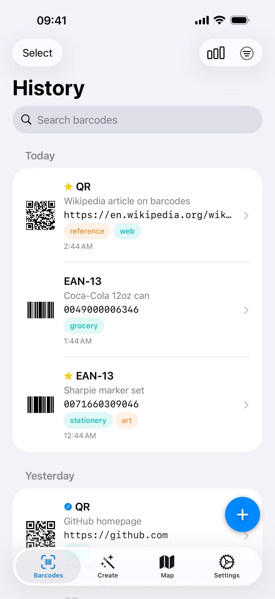
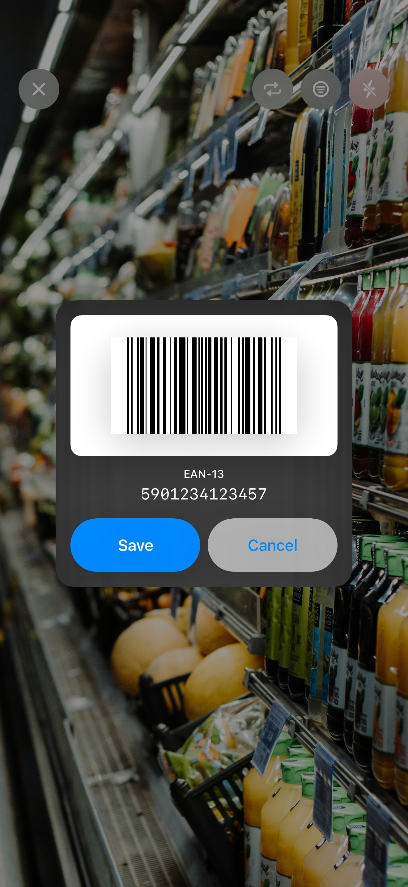
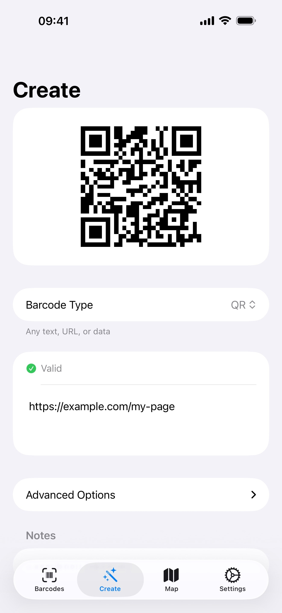
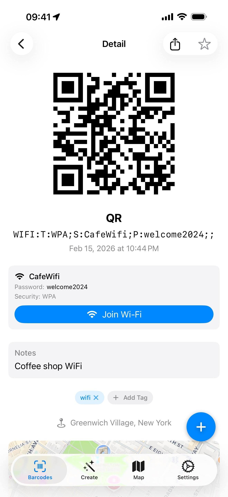
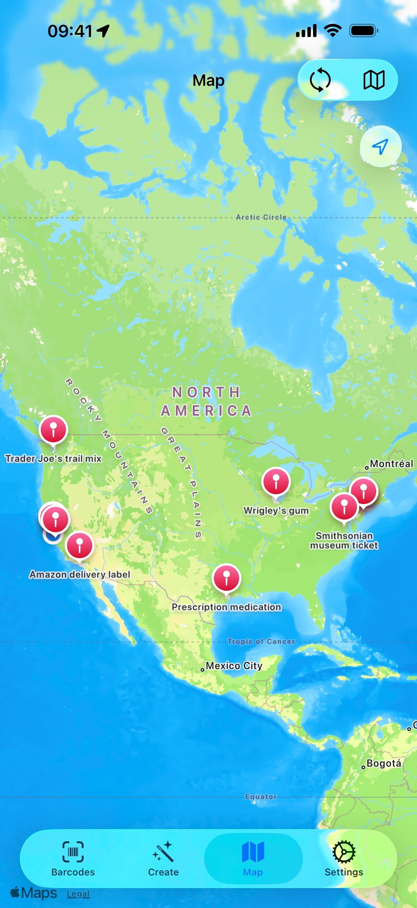

# Barcode Stash

A native iOS app to scan, generate, and organize barcodes - with iCloud sync, smart QR actions, and zero dependencies. **Just 1.3 MB.**

<p align="center">
  
  
  
  
  
  
</p>

<p align="center">
  
  
  
  
  
</p>

<p align="center">
  <a href="https://apps.apple.com/app/id6759092263">
    
  </a>
</p>

## Features

- Scan barcodes using your device camera with instant recognition
- Generate barcodes across 11 different formats with live preview
- Organize with favorites, tags, notes, and full-text search
- View scanned barcodes on a map with automatic reverse geocoding
- Sync your library across devices with iCloud
- Smart QR code actions: open URLs, connect to WiFi, compose emails, make calls, add calendar events, and more
- Export and import your barcode library as JSON
- Display barcodes fullscreen for easy scanning at checkout
- Custom barcode renderer for EAN-13, EAN-8, UPC-E, Code 39, Code 93, ITF-14, and Data Matrix
- Fully native with zero third-party dependencies

## Supported Formats

| 1D       | 2D          |
| -------- | ----------- |
| EAN-13   | QR          |
| EAN-8    | Aztec       |
| UPC-E    | Data Matrix |
| Code 128 | PDF417      |
| Code 39  |             |
| Code 93  |             |
| ITF-14   |             |

## Requirements

- iOS 26.0+
- Physical device required for camera/barcode scanning

## Building from Source

Barcode Stash has **no third-party dependencies** - just clone and build.

```bash
git clone https://github.com/alexislours/barcode-stash.git
cd barcode-stash
xcodebuild -project barcodes.xcodeproj -scheme barcodes \
  -destination 'platform=iOS Simulator,name=iPhone 17 Pro' build
```

Requires **Xcode 26.2+**. Camera and barcode scanning features require a physical device.

### Running Tests

```bash
make test
```

Requires `xcbeautify` and `jq` for formatted output. Unit tests cover barcode validation, payload parsing, encoding, and cloud sync logic.

## Localization

Barcode Stash is localized in 10 languages:

English, German, Spanish, French, Italian, Japanese, Korean, Portuguese (Brazil), Chinese (Simplified), Chinese (Traditional)

Contributions for new translations are welcome! The project uses String Catalogs (`.xcstrings`).

## Contributing

Contributions are welcome! Please see [CONTRIBUTING.md](CONTRIBUTING.md) for guidelines.
